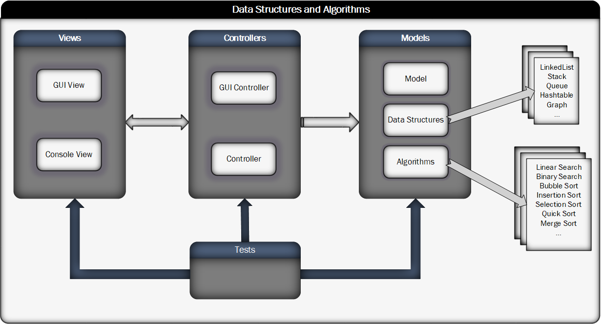
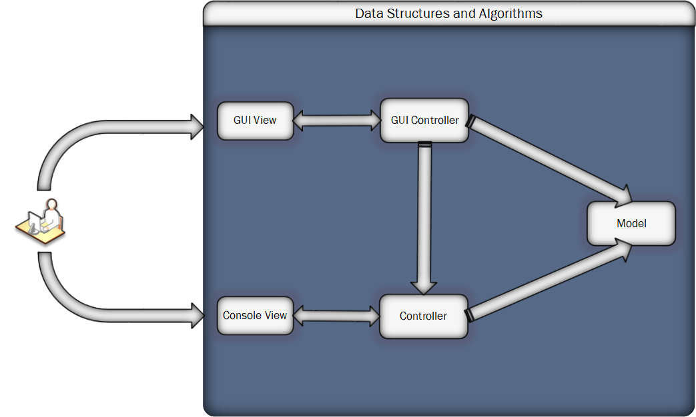
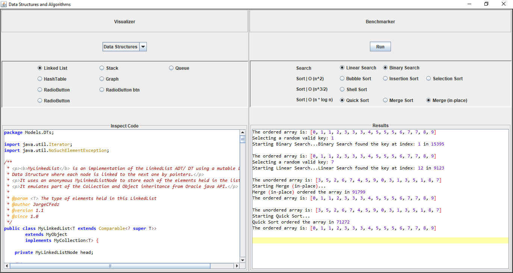
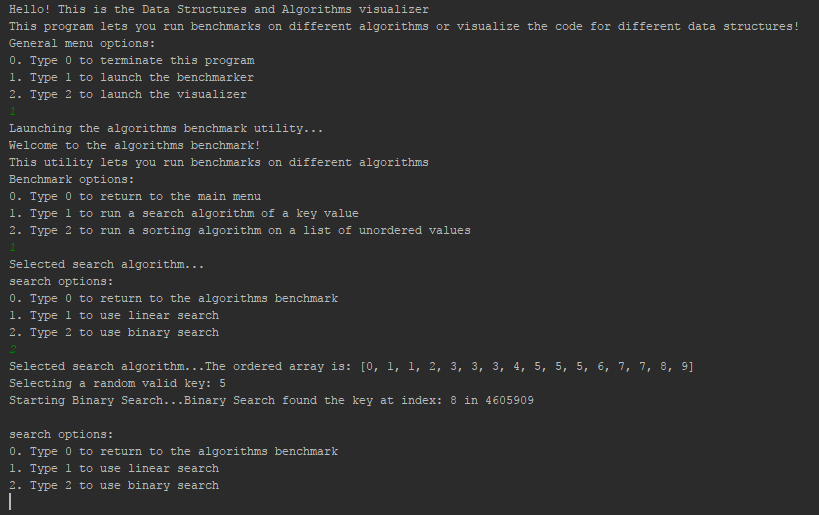
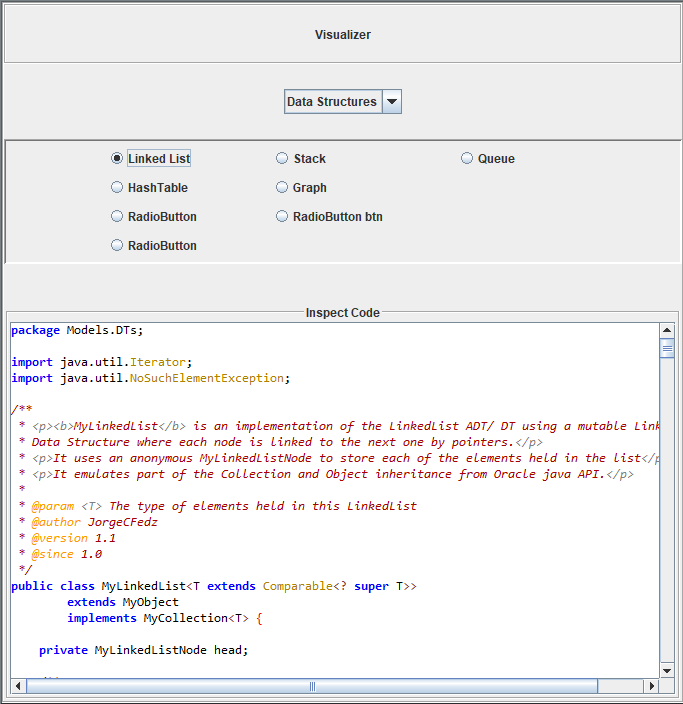
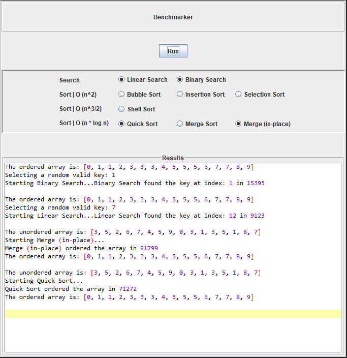
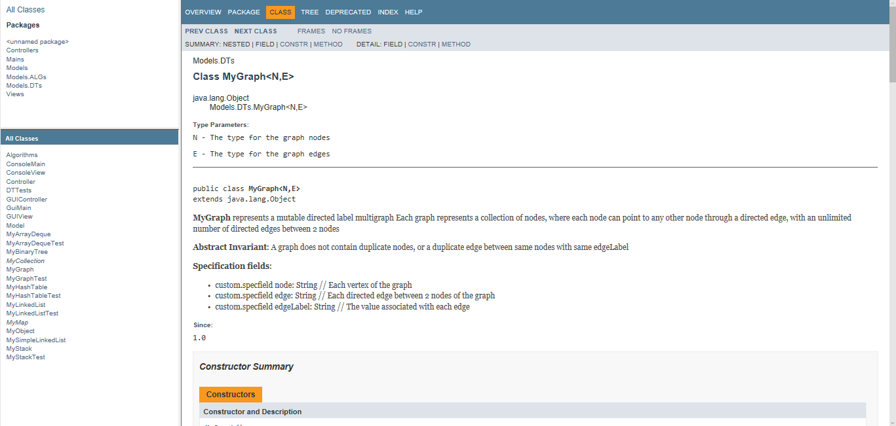
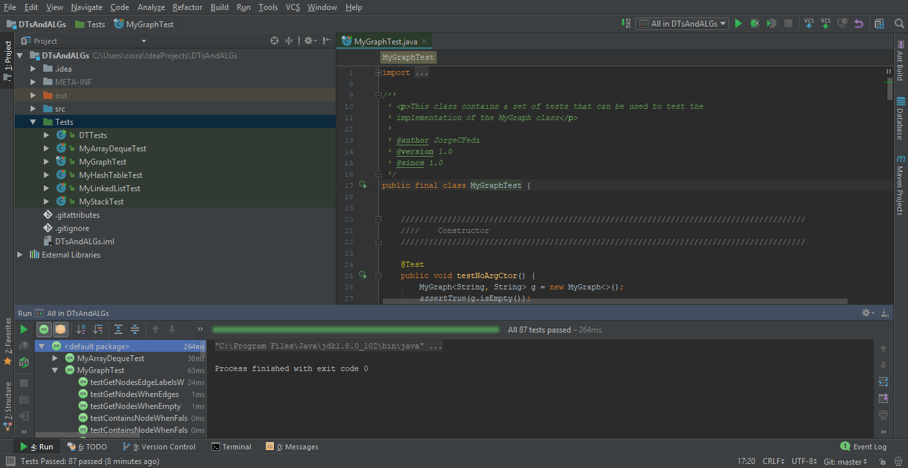
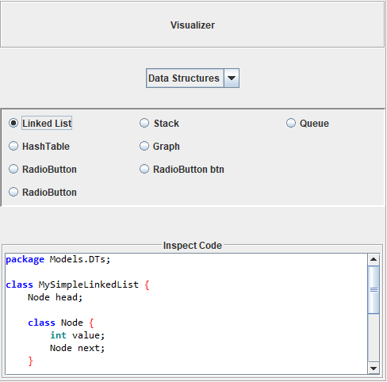

# DTsAndALGs

Tool to visualize and run benchmarks on different data structures and algorithms

> **Version**  
> DTsAndALGs is currently in version 1.0
> - Restricted to jar desktop application.

> **Prerequisites**  
> The minimum prerequisites to run this app are:
> - java sdk 1.8
> - zip file containing different data structures and algorithms 
> - jar executable file

### Introduction
DTsAndALGs helps developers visualize the code for common data structures and algorithms, and run benchmarks using them.
DTsAndALGs uses a simple and intuitive UI to quickly review on the spot. 

* Run multiple benchmarks at the same time.
* Compare results among related benchmarks.
* Quickly visualize and refresh algorithms and data structures code.
* Review simpler implementations or explore real implementations following java API guidelines.
* Avoid the hassles of surfing the web for hours seeking to refresh your basic knowledge of programming fundamentals.
* The result is a quick and reliable experience for the user that compliments other programming learning tools.

The current version is summarized by the following class hierarchy.

| Class hierarchy |
|-------------------------------|
||

### App Highlights

#### MVC - MVP pattern
* Separation of concerns following the MVC-MVP pattern (very limited access to model from view)

| MVC Diagram |
|-------------------------------|
||

#### Views
Separation of concerns facilitates the integration of multiple views.
* GUI view: Launch an interactive graphical panel to quickly navigate through the app options. Preview results in the embedded editor panels.
* Console view: Interact with java console through the input and output streams to access all the app features.  

| GUIView | Console View |
|----------|-------|
|||

#### Visualizer and Benchmarker tools
* Visualizer: Use the combo box to switch between data structures and algorithms. Quickly make your selection using the radio buttons panel.  
* Benchmarker: Select across multiple algorithms to run and quickly compare them using the radio buttons panel. Press run to execute a selection.

| Visualizer | Benchmarker |
|----------|-------|
|||

#### Javadoc documentation
* Thorough project documentation following sun doclet API. Inspect the source structure of the project using your favorite browser.

| Javadoc  |
|----------|
||

#### JUnit testing
* Robust JUnit testing suite.

| JUnit  |
|----------|
||

### Dependencies  
> - DTsAndALGs requires JDK 1.8 or later to build starting with version 1.0.0.  
[JUnit](http://junit.org) JUnit is a unit testing framework. You need JUnit only if you want to run the unit tests. JUnit is licensed under the terms of the IBM Common Public License. The JUnit tests included with JGraphT have been created using JUnit 4.12.  
[RSyntaxTextArea](https://github.com/bobbylight/RSyntaxTextArea) RSyntaxTextArea is a customizable, syntax highlighting text component for Java Swing applications. RSyntaxTextArea is available under a modified BSD license. The RSyntaxTextArea used in this project corresponds to release 3.0.  

### Build  
> **Run it locally using the jar executable file...** 
> - Download the zip file (included as project release) and follow the release instructions.

> **Run it locally using your favorite IDE**  
> - Fork and Clone this project to your local machine. 
> - Open it using your favorite IDE.  
> - Download and add the dependencies to your class path.
> - Compile and run this application using..
>   - src/Mains/ConsoleMain to use the Console View
>   - src/Mains/GUIMain to use the GUI View

### Incoming Features
 - **More data structures**
    - New classes! Binary tree, AVL tree, heap...  
    - New simpler implementations for each class  
    - More accurate java API object implementations 
    
      | Simple  | Complex |
      |----------|----------|
      || |

 - **More algorithms**
    - New Algorithms! A*, Djikstra,...
    - Favorite interview algorithms (QnA): tower of hanoi, house robber, hop...
 - **Fixed file dependency**
    - New database of readable files containing the code for each individual algorithm and data structure. 
    - Algorithms visualizer now properly displays the isolated code for the selected algorithm instead of the whole algorithms static class. 
 - **Fixed benchmarker execution order**
    - Algorithms benchmarks now properly display in the results section grouped by logic order.
 - **Expanded functionality**
    - Benchmarker for common data structures operations (add, remove, access, search, sort)
    - Benchmarker analysis of runtime complexity
 - **Improved UI**
    - Text panel replaced by editor panel with better syntax highlighting and line numbers.
    - Colors! Improved radio buttons highlighted with color.
    - New panel background redesign.
    - New button icons. 
    - New sections Instructions, about, contact me. 
    - Keyboard mnemonics for all buttons. 
 - **More Tests**
    - JUnit tests for algorithms.
    - Black box tests.
    - Integration tests. 
 - **Deployment**
    - Jave Web Start (JavaWS) application. Users can launch the app from a webpage by linking to a Java Network Launch Protocol (JNLP). JNLP enables applications to use resources hosted in a remote web server eliminating the hassle of downloading any files to the user local machine. 
    - Google Web Toolkit (GWT). Compile java code into optimized javascript for automatic deployment through a webpage.
    
### Future Updates
 - **Concurrent classes**
 - **New panel** 
    - Graphics benchmark visualizer. Runtime visualization of benchmark operations. See [Visualgo](https://visualgo.net/en) example.
 - **Results panel morphs into full editor**
    - Compile and execute code with compile warnings and errors. Runtime errors stacktrace.
 - **Cross platform**
    - Mobile Port to android platform or cross platform through a web app with device detection.
 - **Cognitive services integration**
    - The future is here. Desktop, laptop, mobile,...the next platform will be voice.
    - Chatbot integration with voice services. Forget the hassle of searching for the right algorithm or data structure. Simply request it using natural language voice commands.

    
 
 
 
